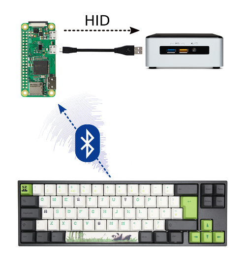

<!-- omit in toc -->
#  Bluetooth to USB

<!-- omit in toc -->
## Table of Contents
- [1. Introduction](#1-introduction)
- [2. Features](#2-features)
- [3. Requirements](#3-requirements)
- [4. Installation](#4-installation)
  - [4.1. Prerequisites](#41-prerequisites)
  - [4.2. Setup](#42-setup)
- [5. Usage](#5-usage)
  - [5.1. Command-line arguments](#51-command-line-arguments)
  - [5.2. Troubleshooting](#52-troubleshooting)
    - [5.2.1. The Pi keeps rebooting or crashes randomly](#521-the-pi-keeps-rebooting-or-crashes-randomly)
    - [5.2.2. The installation was successful, but I don't see any output on the target device](#522-the-installation-was-successful-but-i-dont-see-any-output-on-the-target-device)
    - [5.2.3. I have a different issue](#523-i-have-a-different-issue)
    - [5.2.4. Everything is working, but can it help me with Bitcoin mining?](#524-everything-is-working-but-can-it-help-me-with-bitcoin-mining)
- [6. Bonus points](#6-bonus-points)
- [7. Contributing](#7-contributing)
- [8. License](#8-license)
- [9. Acknowledgments](#9-acknowledgments)

## 1. Introduction
Convert a Raspberry Pi into a HID proxy that relays Bluetooth keyboard and mouse input to USB. Minimal configuration. Zero hassle.

The issue with Bluetooth devices is that you usually can't use them to wake up sleeping devices, access the BIOS or OS select menu (GRUB). Some devices don't even have a (working) Bluetooth interface.  

Sounds familiar? Congratulations! **You just found the solution!**

## 2. Features
- Simple installation and highly automated setup 
- Supports multiple input devices (currently keyboard and mouse)
- Auto-reconnect feature for input devices (power off, energy saving mode, out of range, etc.)
- Robust error handling and logging
- Reliable concurrency using state-of-the-art [TaskGroups](https://docs.python.org/3/library/asyncio-task.html#task-groups)
- Clean and actively maintained code base

## 3. Requirements
- ([Single-board](https://en.wikipedia.org/wiki/Single-board_computer)) computer with Bluetooth support, e.g. Raspberry Pi 4B or Raspberry Pi Zero **_W_**
- Python 3.11 for using [TaskGroups](https://docs.python.org/3/library/asyncio-task.html#task-groups) (script to install from source [available](https://github.com/quaxalber/bluetooth_2_usb/blob/master/install_python_3.11.sh))
- Linux OS with systemd support, e.g. [Raspberry Pi OS](https://www.raspberrypi.com/software/)

## 4. Installation
Follow these steps to install and configure the project:

### 4.1. Prerequisites 
1. Prepare your Raspberry Pi (e.g. using [Pi Imager](https://youtu.be/ntaXWS8Lk34)) and connect to WI-FI & enable SSH, if you intend to access the Pi remotely.
   
2. Connect to the Pi and update the packages:
   ```console
   sudo apt update && sudo apt upgrade -y
   ```

3. Pair and trust any Bluetooth devices you wish to relay, either via GUI or:
   ```console
   bluetoothctl
   scan on
   pair a1:b2:c3:d4:e5:f6
   trust a1:b2:c3:d4:e5:f6
   ```
   (replace `a1:b2:c3:d4:e5:f6` by your Bluetooth device's MAC)

### 4.2. Setup 
4. On the Pi, clone the repository:  
   ```console
   git clone https://github.com/quaxalber/bluetooth_2_usb.git
   ```
   
5. Navigate to the project folder:  
   ```console
   cd bluetooth_2_usb
   ```

6. Run the installation script as root:  
   ```console
   sudo bash install.sh
   ```

7. Restart the Pi (prompt at the end of `install.sh`)
   
8. Check which Linux input devices your Bluetooth devices are mapped to:
   
   8.1. Start an interactive Python session:
   ```console
   python3.11
   ```

   8.2. Copy & paste these commands (`Enter` twice):
   ```python
   import evdev
   devices = [evdev.InputDevice(path) for path in evdev.list_devices()]
   for device in devices:
       print(device.path, device.name, device.phys)
   ```

   8.3. Note the device paths of the devices you want to use:
   ```console
   /dev/input/event3 AceRK Mouse a1:b2:c3:d4:e5:f6     <---
   /dev/input/event2 AceRK Keyboard a1:b2:c3:d4:e5:f6  <---
   /dev/input/event1 vc4-hdmi-1 vc4-hdmi-1/input0
   /dev/input/event0 vc4-hdmi-0 vc4-hdmi-0/input0
   ```

9.  Specify the correct input devices in `bluetooth_2_usb.service`:
    ```console
    nano bluetooth_2_usb.service
    ```

     And change `event3` and `event2` according to **8.3.** 
   
     (`Ctrl + X` > `Y` > `Enter` to exit)

10. (*optional*) If you wish to test first, without actually sending anything to the target devices, append `-s` to the `ExecStart=` command to enable sandbox mode. To increase log verbosity add `-d`.
    
11. Reload and restart service:
    ```console
    sudo systemctl daemon-reload
    sudo service bluetooth_2_usb restart
    ```

12. Verify that the service is running. It should look something like this:
  ```console
  pi@raspberrypi:~/bluetooth_2_usb $ service bluetooth_2_usb status
   ● bluetooth_2_usb.service - Bluetooth to USB HID proxy
      Loaded: loaded (/home/pi/bluetooth_2_usb/bluetooth_2_usb.service; enabled; vendor preset: enabled)
      Active: active (running) since Sat 2023-09-23 18:34:00 BST; 5s ago
      Main PID: 26579 (python3.11)
         Tasks: 1 (limit: 8755)
         CPU: 323ms
      CGroup: /system.slice/bluetooth_2_usb.service
               └─26579 python3.11 /usr/bin/bluetooth_2_usb.py --keyboard /dev/input/event2 --mouse /dev/input/event3

   Sep 23 18:34:00 raspberrypi systemd[1]: Started Bluetooth to USB HID proxy.
   Sep 23 18:34:01 raspberrypi python3.11[26579]: 23-09-23 18:34:01 [INFO] Started event loop for Mouse: [device /dev/input/event3, name "AceRK Mouse", phys "a1:b2:c3:d4:e5:f6"] >> [Boot mouse gadget (/dev/hidg0)]
   Sep 23 18:34:01 raspberrypi python3.11[26579]: 23-09-23 18:34:01 [INFO] Started event loop for Keyboard: [device /dev/input/event2, name "AceRK Keyboard", phys "a1:b2:c3:d4:e5:f6"] >> [Keyboard gadget (/dev/hidg1)]
   ```
    
## 5. Usage
Connect the power USB port of your Pi (Micro-USB or USB-C) via cable with a USB port on your target device. You should hear the USB connection sound (depending on the target device) and be able to access your target device wirelessly using your Bluetooth keyboard or mouse. 

It's essential to use the small power port instead of the bigger USB-A ports, since only the power port has the [OTG](https://en.wikipedia.org/wiki/USB_On-The-Go) feature required for [USB gadgets](https://www.kernel.org/doc/html/latest/driver-api/usb/gadget.html). 

### 5.1. Command-line arguments
Currently you can provide the following CLI arguments:

```console
pi@raspberrypi:~/bluetooth_2_usb $ sudo python3.11 /usr/bin/bluetooth_2_usb.py -h
usage: bluetooth_2_usb.py [-h] [--keyboard KEYBOARD] [--mouse MOUSE] [--sandbox] [--debug] [--log_to_file]
                          [--log_path LOG_PATH]

Bluetooth to USB HID proxy. Reads incoming mouse and keyboard events (e.g., Bluetooth) and forwards them to USB using
Linux's gadget mode.

options:
  -h, --help            show this help message and exit
  --keyboard KEYBOARD, -k KEYBOARD
                        Input device path for keyboard. Default is None.
  --mouse MOUSE, -m MOUSE
                        Input device path for mouse. Default is None.
  --sandbox, -s         Only read input events but do not forward them to the output devices.
  --debug, -d           Enable debug mode. Increases log verbosity
  --log_to_file, -f     Add a handler that logs to file additionally to stdout.
  --log_path LOG_PATH, -p LOG_PATH
                        The path of the log file. Default is /var/log/bluetooth_2_usb/bluetooth_2_usb.log.
```

### 5.2. Troubleshooting

#### 5.2.1. The Pi keeps rebooting or crashes randomly
This is likely due to the limited power the Pi gets from the host. Try these steps:
- If available, connect your Pi to a USB 3 port on the host  / target device (usually blue). 
  
  **IMPORTANT**: *Do not* use the blue (or black) USB-A ports *of your Pi* to connect. This won't work. *Do use* the small USB power port. 
- Try to connect to the Pi via SSH instead of attaching a disply directly and remove any unnecessary peripherals.
- Install a [lite version](https://downloads.raspberrypi.org/raspios_lite_arm64/images/) of your OS on the Pi (without GUI)
- Get a [USB-C Data/Power Splitter](https://thepihut.com/products/usb-c-data-power-splitter) (or [Micro-USB](https://thepihut.com/products/micro-usb-data-power-splitter) respectively) and draw power from a sufficiently powerful power adaptor (the Pi 4B requires 3A/15W for stable operation!)

#### 5.2.2. The installation was successful, but I don't see any output on the target device 
This could be due to a number of reasons. Try these steps:
- Verify that the service is running:
  ```console
  service bluetooth_2_usb status
  ```
- Verify that you specified the correct input devices in `bluetooth_2_usb.service` and that sandbox mode is off (that is no `--sandbox` or `-s` flag)
- Check the log files at `/var/log/bluetooth_2_usb/` for errors (logging to file requires the `-f` flag)
- You may also query the journal to inspect the service logs in real-time:
  ```console
  journalctl -u bluetooth_2_usb.service -n 20 -f
  ```
- Increase log verbosity by appending `-d` to the command in the line starting with `ExecStart=` in `bluetooth_2_usb.service`. 
- Reload and restart service:
  ```console
  sudo systemctl daemon-reload
  sudo service bluetooth_2_usb restart
  ```
- For easier degguging, you may also stop the service 
   ```console
   sudo service bluetooth_2_usb stop
   ```
   and run the script manually, modifying arguments as required, e.g.:
   ```console
   sudo python3.11 /usr/bin/bluetooth_2_usb.py -k /dev/input/event2 -m /dev/input/event3 -ds
   ```
- When you interact with your Bluetooth devices with `-d` set, you should see debug output in the logs such as:
   ```console
   23-09-23 18:32:02 [DEBUG] Received event: [event at 1695490322.588185, code 04, type 04, val 589826] for /dev/hidg0
   23-09-23 18:32:02 [DEBUG] Received event: [key event at 1695490322.588185, 273 (BTN_RIGHT), up] for /dev/hidg0
   23-09-23 18:32:02 [DEBUG] Converted ecode 273 to HID keycode 2
   23-09-23 18:32:02 [DEBUG] Received event: [synchronization event at 1695490322.588185, SYN_REPORT] for /dev/hidg0
   23-09-23 18:32:03 [DEBUG] Received event: [relative axis event at 1695490323.368208, REL_X] for /dev/hidg0
   23-09-23 18:32:03 [DEBUG] Sending mouse event: (x, y, mwheel) = (125, 0, 0) to /dev/hidg0
   23-09-23 18:32:03 [DEBUG] Received event: [synchronization event at 1695490323.368208, SYN_REPORT] for /dev/hidg0
   ```

#### 5.2.3. I have a different issue 
Here's a few things you could try:
- Reload and restart service:
  ```console
  sudo systemctl daemon-reload
  sudo service bluetooth_2_usb restart
  ```
- Reboot Pi
  ```console
  sudo reboot 
  ```
- Re-connect the Pi to the host and check that the cable is in good shape 
- Try a different USB port on the host
- Try connecting to a different host 
- Double-check the [Installation instructions](#4-installation)
- For more help, open an [issue](https://github.com/quaxalber/bluetooth_2_usb/issues) in the [GitHub repository](https://github.com/quaxalber/bluetooth_2_usb)

#### 5.2.4. Everything is working, but can it help me with Bitcoin mining? 
Absolutely! [Here's how](https://bit.ly/42BTC). 

## 6. Bonus points 
After successfully setting up your Pi as a HID proxy for your Bluetooth devices, you may consider making [Raspberry OS read-only](https://learn.adafruit.com/read-only-raspberry-pi/overview). That helps preventing the SD card from wearing out and the file system from getting corrupted when powering off the Raspberry forcefully.

## 7. Contributing
Contributions are welcome! Please read the [CONTRIBUTING.md](CONTRIBUTING.md) file for guidelines.

## 8. License
This project is licensed under the MIT License - see the [LICENSE.md](LICENSE.md) file for details.

"Bluetooth 2 HID" image [@PixelGordo](https://twitter.com/PixelGordo) is licensed under a [Creative Commons Attribution-NonCommercial 4.0 International License](http://creativecommons.org/licenses/by-nc/4.0/).


## 9. Acknowledgments
* [Mike Redrobe](https://github.com/mikerr/pihidproxy) for the idea and the basic code logic and [HeuristicPerson's bluetooth_2_hid](https://github.com/HeuristicPerson/bluetooth_2_hid) based off this.
* [Georgi Valkov](https://github.com/gvalkov) for [python-evdev](https://github.com/gvalkov/python-evdev) making reading input devices a walk in the park. 
* The folks at [Adafruit](https://www.adafruit.com/) for [CircuitPython HID](https://github.com/adafruit/Adafruit_CircuitPython_HID) providing super smooth access to USB gadgets. 
* Special thanks to the open-source community for various other libraries and tools.
