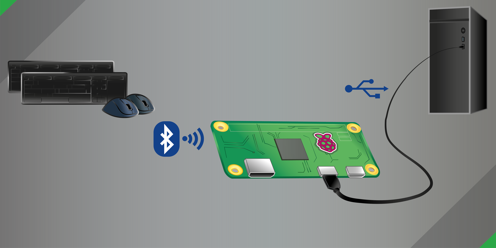

<!-- omit in toc -->
# Bluetooth to USB



<!-- omit in toc -->
## Table of Contents

- [1. Introduction](#1-introduction)
- [2. Features](#2-features)
- [3. Requirements](#3-requirements)
- [4. Installation](#4-installation)
  - [4.1. Prerequisites](#41-prerequisites)
  - [4.2. Setup](#42-setup)
- [5. Usage](#5-usage)
  - [5.1. Connection to target device / host](#51-connection-to-target-device--host)
    - [5.1.1. Raspberry Pi 4 Model B](#511-raspberry-pi-4-model-b)
    - [5.1.2. Raspberry Pi Zero (2) W(H)](#512-raspberry-pi-zero-2-wh)
  - [5.2. Command-line arguments](#52-command-line-arguments)
  - [5.3. Consuming the API from your Python code](#53-consuming-the-api-from-your-python-code)
- [6. Updating](#6-updating)
- [7. Uninstallation](#7-uninstallation)
- [8. Troubleshooting](#8-troubleshooting)
  - [8.1. The Pi keeps rebooting or crashes randomly](#81-the-pi-keeps-rebooting-or-crashes-randomly)
  - [8.2. The installation was successful, but I don't see any output on the target device](#82-the-installation-was-successful-but-i-dont-see-any-output-on-the-target-device)
  - [8.3. In bluetoothctl, my device is constantly switching on/off](#83-in-bluetoothctl-my-device-is-constantly-switching-onoff)
  - [8.4. I have a different issue](#84-i-have-a-different-issue)
  - [8.5. Everything is working, but can it help me with Bitcoin mining?](#85-everything-is-working-but-can-it-help-me-with-bitcoin-mining)
- [9. Bonus points](#9-bonus-points)
- [10. Contributing](#10-contributing)
- [11. License](#11-license)
- [12. Acknowledgments](#12-acknowledgments)

## 1. Introduction

Convert a Raspberry Pi into a HID relay that translates Bluetooth keyboard and mouse input to USB. Minimal configuration. Zero hassle.

The issue with Bluetooth devices is that you usually can't use them to:
- wake up sleeping devices,
- access the BIOS or OS select menu (e.g., GRUB),
- access devices without Bluetooth interface (e.g., devices in a restricted environment or most KVM switches).

Sounds familiar? Congratulations! **You just found the solution!**

Linux's gadget mode allows a Raspberry Pi to act as USB HID (Human Interface Device). Therefore, from the host's perspective, it appears like a regular USB keyboard or mouse. You may think of your Pi as a multi-device Bluetooth dongle.

## 2. Features

- Simple installation and highly automated setup
- Supports multiple input devices (currently keyboard and mouse - more than one of each kind simultaneously)
- Supports [146 multimedia keys](https://github.com/quaxalber/bluetooth_2_usb/blob/8b1c5f8097bbdedfe4cef46e07686a1059ea2979/lib/evdev_adapter.py#L142) (e.g., mute, volume up/down, launch browser, etc.)
- Auto-discovery feature for input devices
- Auto-reconnect feature for input devices (power off, energy saving mode, out of range, etc.)
- Robust error handling and logging
- Installation as a systemd service
- Reliable concurrency using state-of-the-art [TaskGroups](https://docs.python.org/3/library/asyncio-task.html#task-groups)
- Clean and actively maintained code base

## 3. Requirements

- A Raspberry Pi with Bluetooth and [USB OTG support](https://en.wikipedia.org/wiki/USB_On-The-Go) required for [USB gadgets](https://www.kernel.org/doc/html/latest/driver-api/usb/gadget.html) in so-called device mode. Supported models include:
  - **Raspberry Pi Zero W(H)**: Includes Bluetooth 4.1 and supports USB OTG with the lowest price tag.
  - **Raspberry Pi Zero 2 W**: Similar to the Raspberry Pi Zero W, it has Bluetooth 4.1 and USB OTG support while providing additional processing power.
  - **Raspberry Pi 4 Model B**: Offers Bluetooth 5.0 and USB-C OTG support for device mode, providing the best performance (that is until the Pi 5 is available).
- Linux OS with systemd support (e.g., [Raspberry Pi OS](https://www.raspberrypi.com/software/), recommended).
- Python 3.11 for using [TaskGroups](https://docs.python.org/3/library/asyncio-task.html#task-groups).

> [!NOTE]
> Raspberry Pi 3 Models feature Bluetooth 4.2 but no native USB gadget mode support. Earlier models like Raspberry Pi 1 and 2 do not support Bluetooth natively and have no USB gadget mode support.

> [!NOTE]
> The latest version of Raspberry Pi OS, based on Debian Bookworm, supports Python 3.11 through the official package repositories. For older versions, you may [build it from source](https://github.com/quaxalber/bluetooth_2_usb/blob/main/scripts/build_python_3.11.sh). Note that building may take anything between a few minutes (Pi 4B) and more than an hour (Pi 0W).

## 4. Installation

Follow these steps to install and configure the project:

### 4.1. Prerequisites

1. Install an OS on your Raspberry Pi (e.g., using [Pi Imager](https://youtu.be/ntaXWS8Lk34))
  
2. Connect to a network via Ethernet cable or [Wi-Fi](https://www.raspberrypi.com/documentation/computers/configuration.html#configuring-networking). Make sure this network has Internet access.
  
3. (*optional, recommended*) Enable [SSH](https://www.raspberrypi.com/documentation/computers/remote-access.html#ssh), if you intend to access the Pi remotely.

> [!NOTE]
> These settings above may be configured [during imaging](https://www.raspberrypi.com/documentation/computers/getting-started.html#advanced-options) (recommended), [on first boot](https://www.raspberrypi.com/documentation/computers/getting-started.html#configuration-on-first-boot) or [afterwards](https://www.raspberrypi.com/documentation/computers/configuration.html).
  
4. Connect to the Pi and make sure `git` is installed:
  
   ```console
   sudo apt update && sudo apt upgrade -y && sudo apt install -y git
   ```

5. Pair and trust any Bluetooth devices you wish to relay, either via GUI or via CLI:
  
   ```console
   bluetoothctl
   scan on
   ```

   ... wait for your devices to show up and note their MAC addresses (you may also type the first characters and hit `TAB` for auto-completion in the following commands) ...

   ```console
   trust A1:B2:C3:D4:E5:F6
   pair A1:B2:C3:D4:E5:F6
   connect A1:B2:C3:D4:E5:F6
   ```

> [!NOTE]
> Replace `A1:B2:C3:D4:E5:F6` by your input device's Bluetooth MAC address

### 4.2. Setup

6. On the Pi, clone the repository to your home directory:
  
   ```console
   cd ~ && git clone https://github.com/quaxalber/bluetooth_2_usb.git
   ```

7. Run the installation script as root:
   
   ```console
   sudo ~/bluetooth_2_usb/scripts/install.sh
   ```

8.  Reboot:
 
    ```console
    sudo reboot
    ``` 

9.  Verify that the service is running:
   
    ```console
    service bluetooth_2_usb status
    ```

    It should look something like this and say `Active: active (running)`:

    ```console
    user@pi0w:~ $ service bluetooth_2_usb status
    ● bluetooth_2_usb.service - Bluetooth to USB HID relay
        Loaded: loaded (/etc/systemd/system/bluetooth_2_usb.service; enabled; preset: enabled)
        Active: active (running) since Sat 2023-12-02 23:16:37 CET; 15s ago
      Main PID: 1319 (bash)
         Tasks: 2 (limit: 389)
           CPU: 2.526s
        CGroup: /system.slice/bluetooth_2_usb.service
                 ├─1319 bash /usr/bin/bluetooth_2_usb --auto_discover
                 └─1326 python3.11 /home/user/bluetooth_2_usb/bluetooth_2_usb.py --auto_discover

    Dec 02 23:16:37 pi0w systemd[1]: Started bluetooth_2_usb.service - Bluetooth to USB HID relay.
    Dec 02 23:16:39 pi0w bluetooth_2_usb[1326]: 23-12-02 23:16:39 [INFO] Launching Bluetooth 2 USB v0.6.6
    Dec 02 23:16:39 pi0w bluetooth_2_usb[1326]: 23-12-02 23:16:39 [INFO] Discovering input devices...
    Dec 02 23:16:42 pi0w bluetooth_2_usb[1326]: 23-12-02 23:16:42 [INFO] Activated relay for device /dev/input/event2, name "AceRK Mouse", phys "a1:b2:c3:d4:e5:f6"
    Dec 02 23:16:45 pi0w bluetooth_2_usb[1326]: 23-12-02 23:16:45 [INFO] Activated relay for device /dev/input/event1, name "AceRK Keyboard", phys "a1:b2:c3:d4:e5:f6"
    Dec 02 23:16:48 pi0w bluetooth_2_usb[1326]: 23-12-02 23:16:48 [INFO] Activated relay for device /dev/input/event0, name "vc4-hdmi", phys "vc4-hdmi/input0"
    ```

> [!NOTE]
> Something seems off? Try yourself in [Troubleshooting](#8-troubleshooting)!
   
## 5. Usage

### 5.1. Connection to target device / host

#### 5.1.1. Raspberry Pi 4 Model B

Connect the _USB-C power port_ of your Pi 4B via cable with a USB port on your target device. You should hear the USB connection sound (depending on the target device) and be able to access your target device wirelessly using your Bluetooth keyboard or mouse. In case the Pi solely draws power from the host, it will take some time for the Pi to boot.

> [!IMPORTANT]
> It's essential to use the small power port instead of the bigger USB-A ports, since only the power port has the [OTG](https://en.wikipedia.org/wiki/USB_On-The-Go) feature required for [USB gadgets](https://www.kernel.org/doc/html/latest/driver-api/usb/gadget.html).

#### 5.1.2. Raspberry Pi Zero (2) W(H)

For the Pi Zero, the situation is quite the opposite: Do _not_ use the power port to connect to the target device, _use_ the other port instead (typically labeled "DATA" or "USB"). You may connect the power port to a stable power supply.

### 5.2. Command-line arguments

Currently you can provide the following CLI arguments:

```console
user@pi0w:~ $ bluetooth_2_usb -h
usage: bluetooth_2_usb [-h] [--device_ids DEVICE_IDS] [--auto_discover] [--debug] [--log_to_file] [--log_path LOG_PATH] [--version] [--list_devices]

Bluetooth to USB HID relay. Handles Bluetooth keyboard and mouse events from multiple input devices and translates them to USB using Linux's gadget mode.

options:
  -h, --help            show this help message and exit
  --device_ids DEVICE_IDS, -i DEVICE_IDS
                        Comma-separated list of identifiers for input devices to be relayed. An identifier is either the input device path, the MAC address or any case-insensitive substring of the device name. Default is None. Example: --device_ids '/dev/input/event2,a1:b2:c3:d4:e5:f6,0A-1B-2C-3D-4E-5F,logi'
  --auto_discover, -a   Enable auto-discovery mode. All readable input devices will be relayed automatically.
  --debug, -d           Enable debug mode. Increases log verbosity
  --log_to_file, -f     Add a handler that logs to file additionally to stdout.
  --log_path LOG_PATH, -p LOG_PATH
                        The path of the log file. Default is /var/log/bluetooth_2_usb/bluetooth_2_usb.log.
  --version, -v         Display the version number of this software and exit.
  --list_devices, -l    List all available input devices and exit.
```

### 5.3. Consuming the API from your Python code

The API is designed such that it may be consumed both via CLI and from within external Python code. More details on this [coming soon](https://github.com/quaxalber/bluetooth_2_usb/issues/16)!

## 6. Updating

You may update to the latest stable release by running:

```console
sudo ~/bluetooth_2_usb/scripts/update.sh
```

> [!NOTE]
> The update script performs a clean reinstallation, that is run `uninstall.sh`, delete the repo folder, clone again and run the install script.

## 7. Uninstallation

You may uninstall Bluetooth 2 USB by running:

```console
sudo ~/bluetooth_2_usb/scripts/uninstall.sh
```

## 8. Troubleshooting

### 8.1. The Pi keeps rebooting or crashes randomly

This is likely due to the limited power the Pi can draw from the host's USB port. Try these steps:

- If available, connect your Pi to a USB 3 port on the host / target device (usually blue) or preferably USB-C.
 
> [!IMPORTANT]
> *Do not use* the blue (or black) USB-A ports *of your Pi* to connect. **This won't work.**
>
> *Do use* the small USB-C power port (in case of Pi 4B). For Pi Zero, use the data port to connect to the host and attach the power port to a dedicated power supply.

- Try to [connect to the Pi via SSH](#41-prerequisites) instead of attaching a display directly and remove any unnecessary peripherals.
 
- Install a [lite version](https://downloads.raspberrypi.org/raspios_lite_arm64/images/) of your OS on the Pi (without GUI)
 
- For Pi 4B: Get a [USB-C Data/Power Splitter](https://thepihut.com/products/usb-c-data-power-splitter) and draw power from a dedicated power supply. This should ultimately resolve any power-related issues, and your Pi 4B will no longer be dependent on the host's power supply.
 
> [!NOTE]
> The Pi Zero is recommended to have a 1.2 A power supply for stable operation, the Pi Zero 2 requires 2.0 A and the Pi 4B even 3.0 A, while hosts may typically only supply up to 0.5/0.9 A through USB-A 2.0/3.0 ports. However, this may be sufficient depending on your specific soft- and hardware configuration. For more information see the [Raspberry Pi documentation](https://www.raspberrypi.com/documentation/computers/raspberry-pi.html#power-supply).

### 8.2. The installation was successful, but I don't see any output on the target device

This could be due to a number of reasons. Try these steps:

- Verify that the service is running:
 
  ```console
  service bluetooth_2_usb status
  ```

- Verify that you specified the correct input devices in `bluetooth_2_usb.service`
 
- Verify that your Bluetooth devices are paired, trusted, connected and *not* blocked:
 
  ```console
  bluetoothctl
  info A1:B2:C3:D4:E5:F6
  ```
 
  It should look like this:

  ```console
  user@pi0w:~ $ bluetoothctl
  Agent registered
  [CHG] Controller 0A:1B:2C:3D:4E:5F Pairable: yes
  [AceRK]# info A1:B2:C3:D4:E5:F6
  Device A1:B2:C3:D4:E5:F6 (random)
          Name: AceRK
          Alias: AceRK
          Paired: yes     <---
          Trusted: yes    <---
          Blocked: no     <---
          Connected: yes  <---
          WakeAllowed: no
          LegacyPairing: no
          UUID: Generic Access Profile    (00001800-0000-1000-8000-00805f9b34fb)
          UUID: Generic Attribute Profile (00001801-0000-1000-8000-00805f9b34fb)
          UUID: Device Information        (0000180a-0000-1000-8000-00805f9b34fb)
          UUID: Human Interface Device    (00001812-0000-1000-8000-00805f9b34fb)
          UUID: Nordic UART Service       (6e400001-b5a3-f393-e0a9-e50e24dcca9e)
  ```
 
> [!NOTE]
> Replace `A1:B2:C3:D4:E5:F6` by your input device's Bluetooth MAC address

- Reload and restart service:
 
  ```console
  sudo systemctl daemon-reload && sudo service bluetooth_2_usb restart
  ```

- Reboot Pi
 
  ```console
  sudo reboot
  ```

- Re-connect the Pi to the host and check that the cable is capable of transmitting data, not power only
 
- Try a different USB port on the host
 
- Try connecting to a different host

### 8.3. In bluetoothctl, my device is constantly switching on/off

This is a common issue, especially when the device gets paired with multiple hosts. One simple fix/workaround is to re-pair the device:

```console
bluetoothctl
power off
power on
block A1:B2:C3:D4:E5:F6
remove A1:B2:C3:D4:E5:F6
scan on
trust A1:B2:C3:D4:E5:F6
pair A1:B2:C3:D4:E5:F6
connect A1:B2:C3:D4:E5:F6
```

If the issue persists, it's worth trying to delete the cache:

```console
sudo -i
cd '/var/lib/bluetooth/0A:1B:2C:3D:4E:5F/cache'
rm -rf 'A1:B2:C3:D4:E5:F6'
exit
```

> [!NOTE]
> Replace `0A:1B:2C:3D:4E:5F` by your Pi's Bluetooth controller's MAC and `A1:B2:C3:D4:E5:F6` by your input device's MAC

### 8.4. I have a different issue

Here's a few things you could try:

- Check the log files (default at `/var/log/bluetooth_2_usb/`) for errors
 
> [!NOTE]
> Logging to file requires the `-f` flag

- You may also query the journal to inspect the service logs in real-time:
 
  ```console
  journalctl -u bluetooth_2_usb.service -n 50 -f
  ```

- For easier degguging, you may temporarily stop the service and run the script manually, modifying arguments as required, e.g., increase log verbosity by appending `-d`:

  ```console
  sudo service bluetooth_2_usb stop && sudo bluetooth_2_usb -ad ; sudo service bluetooth_2_usb start
  ```

- When you interact with your Bluetooth devices with `-d` set, you should see debug output in the logs such as:

> [!NOTE]
> Click [show debug output] for more
  
  <details><summary>[show debug output]</summary>
  <p> 
  
  ```console
  user@pi0w:~ $ sudo service bluetooth_2_usb stop && sudo bluetooth_2_usb -i logi,a1:b2:c3:d4:e5:f6,/dev/input/event3 -d ; sudo service bluetooth_2_usb start
  23-12-06 14:19:36 [DEBUG] CLI args: Namespace(device_ids=['logi', 'a1:b2:c3:d4:e5:f6', '/dev/input/event3'], auto_discover=False, debug=True, log_to_file=False, log_path='/var/log/bluetooth_2_usb/bluetooth_2_usb.log', version=False, list_devices=False)
  23-12-06 14:19:36 [DEBUG] Logging to stdout
  23-12-06 14:19:36 [INFO] Launching Bluetooth 2 USB v0.6.6
  23-12-06 14:19:36 [DEBUG] Available USB devices: [Mouse gadget (/dev/hidg0), Keyboard gadget (/dev/hidg1), Consumer control gadget (/dev/hidg2)]
  23-12-06 14:19:36 [INFO] Discovering input devices...
  23-12-06 14:19:36 [DEBUG] Relaying devices with matching name "logi" or MAC "a1:b2:c3:d4:e5:f6" or path "/dev/input/event3"
  23-12-06 14:19:39 [INFO] Activated relay for device /dev/input/event2, name "AceRK Mouse", phys "a1:b2:c3:d4:e5:f6"
  23-12-06 14:19:42 [INFO] Activated relay for device /dev/input/event1, name "AceRK Keyboard", phys "a1:b2:c3:d4:e5:f6"
  >>> Manually switched Pi's Bluetooth off <<<
  23-12-06 14:20:44 [CRITICAL] Connection to AceRK Keyboard lost [OSError(19, 'No such device')]
  23-12-06 14:20:44 [CRITICAL] Connection to AceRK Mouse lost [OSError(19, 'No such device')]
  >>> Manually switched Pi's Bluetooth back on <<<
  23-12-06 14:20:53 [INFO] Activated relay for device /dev/input/event2, name "AceRK Mouse", phys "a1:b2:c3:d4:e5:f6"
  23-12-06 14:20:56 [INFO] Activated relay for device /dev/input/event1, name "AceRK Keyboard", phys "a1:b2:c3:d4:e5:f6"
  23-12-06 14:21:08 [DEBUG] Received event at 1701868868.638665, code 02, type 17, val 01 from AceRK Keyboard
  23-12-06 14:21:08 [DEBUG] Received event at 1701868868.638665, code 04, type 04, val 458756 from AceRK Keyboard
  23-12-06 14:21:08 [DEBUG] Received key event at 1701868868.638665, 30 (KEY_A), down from AceRK Keyboard
  23-12-06 14:21:08 [DEBUG] Converted evdev scancode 0x1E (KEY_A) to HID UsageID 0x04 (A)
  23-12-06 14:21:08 [DEBUG] Pressing A (0x04) on /dev/hidg1
  23-12-06 14:21:08 [DEBUG] Received synchronization event at 1701868868.638665, SYN_REPORT from AceRK Keyboard
  23-12-06 14:21:08 [DEBUG] Received event at 1701868868.639487, code 04, type 04, val 458756 from AceRK Keyboard
  23-12-06 14:21:08 [DEBUG] Received key event at 1701868868.639487, 30 (KEY_A), up from AceRK Keyboard
  23-12-06 14:21:08 [DEBUG] Converted evdev scancode 0x1E (KEY_A) to HID UsageID 0x04 (A)
  23-12-06 14:21:08 [DEBUG] Releasing A (0x04) on /dev/hidg1
  23-12-06 14:21:08 [DEBUG] Received synchronization event at 1701868868.639487, SYN_REPORT from AceRK Keyboard
  23-12-06 14:21:58 [DEBUG] Received event at 1701868918.851380, code 04, type 04, val 786666 from AceRK Keyboard
  23-12-06 14:21:58 [DEBUG] Received key event at 1701868918.851380, 114 (KEY_VOLUMEDOWN), down from AceRK Keyboard
  23-12-06 14:21:58 [DEBUG] Converted evdev scancode 0x72 (KEY_VOLUMEDOWN) to HID UsageID 0xEA (VOLUME_DECREMENT)
  23-12-06 14:21:58 [DEBUG] Pressing VOLUME_DECREMENT (0xEA) on /dev/hidg2
  23-12-06 14:21:58 [DEBUG] Received synchronization event at 1701868918.851380, SYN_REPORT from AceRK Keyboard
  23-12-06 14:21:58 [DEBUG] Received event at 1701868918.852051, code 04, type 04, val 786666 from AceRK Keyboard
  23-12-06 14:21:58 [DEBUG] Received key event at 1701868918.852051, 114 (KEY_VOLUMEDOWN), up from AceRK Keyboard
  23-12-06 14:21:58 [DEBUG] Converted evdev scancode 0x72 (KEY_VOLUMEDOWN) to HID UsageID 0xEA (VOLUME_DECREMENT)
  23-12-06 14:21:58 [DEBUG] Releasing VOLUME_DECREMENT (0xEA) on /dev/hidg2
  23-12-06 14:21:58 [DEBUG] Received synchronization event at 1701868918.852051, SYN_REPORT from AceRK Keyboard
  23-12-06 14:22:00 [DEBUG] Received event at 1701868920.411452, code 04, type 04, val 589826 from AceRK Mouse
  23-12-06 14:22:00 [DEBUG] Received key event at 1701868920.411452, 273 (BTN_RIGHT), down from AceRK Mouse
  23-12-06 14:22:00 [DEBUG] Converted evdev scancode 0x111 (BTN_RIGHT) to HID UsageID 0x02 (RIGHT)
  23-12-06 14:22:00 [DEBUG] Pressing RIGHT (0x02) on /dev/hidg0
  23-12-06 14:22:00 [DEBUG] Received synchronization event at 1701868920.411452, SYN_REPORT from AceRK Mouse
  23-12-06 14:22:00 [DEBUG] Received event at 1701868920.460166, code 04, type 04, val 589826 from AceRK Mouse
  23-12-06 14:22:00 [DEBUG] Received key event at 1701868920.460166, 273 (BTN_RIGHT), up from AceRK Mouse
  23-12-06 14:22:00 [DEBUG] Converted evdev scancode 0x111 (BTN_RIGHT) to HID UsageID 0x02 (RIGHT)
  23-12-06 14:22:00 [DEBUG] Releasing RIGHT (0x02) on /dev/hidg0
  23-12-06 14:22:00 [DEBUG] Received synchronization event at 1701868920.460166, SYN_REPORT from AceRK Mouse
  23-12-06 14:22:01 [DEBUG] Received relative axis event at 1701868921.288916, REL_X from AceRK Mouse
  23-12-06 14:22:01 [DEBUG] Moving mouse /dev/hidg0 (x=125, y=0, mwheel=0)
  23-12-06 14:22:01 [DEBUG] Received synchronization event at 1701868921.288916, SYN_REPORT from AceRK Mouse
  ^C23-12-06 14:22:12 [INFO] Exiting gracefully. Received signal: 2, frame: <frame at 0xb5f40df8, file '/usr/lib/python3.11/selectors.py', line 468, code select>
  23-12-06 14:22:12 [CRITICAL] AceRK Keyboard was cancelled
  23-12-06 14:22:12 [CRITICAL] AceRK Mouse was cancelled
  ```

  </p>
  </details> 

- Still not resolved? Double-check the [installation instructions](#4-installation)
 
- For more help, open an [issue](https://github.com/quaxalber/bluetooth_2_usb/issues) in the [GitHub repository](https://github.com/quaxalber/bluetooth_2_usb)

### 8.5. Everything is working, but can it help me with Bitcoin mining?

Absolutely! [Here's how](https://bit.ly/42BTC).

## 9. Bonus points

After successfully setting up your Pi as a HID proxy for your Bluetooth devices, you may consider making [Raspberry Pi OS read-only](https://learn.adafruit.com/read-only-raspberry-pi/overview). That helps preventing the SD card from wearing out and the file system from getting corrupted when powering off the Raspberry forcefully.

## 10. Contributing

Contributions are welcome! Please read the [CONTRIBUTING.md](https://github.com/quaxalber/bluetooth_2_usb/blob/main/CONTRIBUTING.md) file for guidelines.

## 11. License

This project is licensed under the MIT License - see the [LICENSE](https://github.com/quaxalber/bluetooth_2_usb/blob/main/LICENSE) file for details.

"Bluetooth 2 HID" image [@PixelGordo](https://twitter.com/PixelGordo) is licensed under a [Creative Commons Attribution-NonCommercial 4.0 International License](http://creativecommons.org/licenses/by-nc/4.0/).


## 12. Acknowledgments

* [Mike Redrobe](https://github.com/mikerr/pihidproxy) for the idea and the basic code logic and [HeuristicPerson's bluetooth_2_hid](https://github.com/HeuristicPerson/bluetooth_2_hid) based off this.
* [Georgi Valkov](https://github.com/gvalkov) for [python-evdev](https://github.com/gvalkov/python-evdev) making reading input devices a walk in the park.
* The folks at [Adafruit](https://www.adafruit.com/) for [CircuitPython HID](https://github.com/adafruit/Adafruit_CircuitPython_HID) and [Blinka](https://github.com/quaxalber/Adafruit_Blinka/blob/main/src/usb_hid.py) providing super smooth access to USB gadgets.
* Special thanks to the open-source community for various other libraries and tools.
